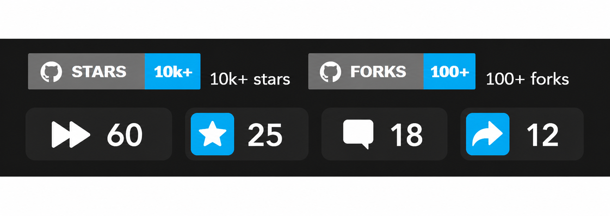
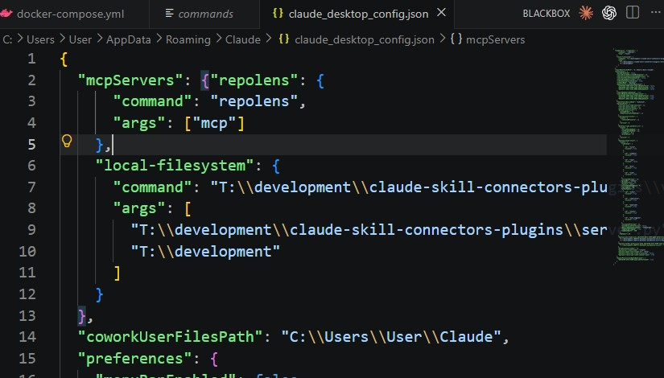
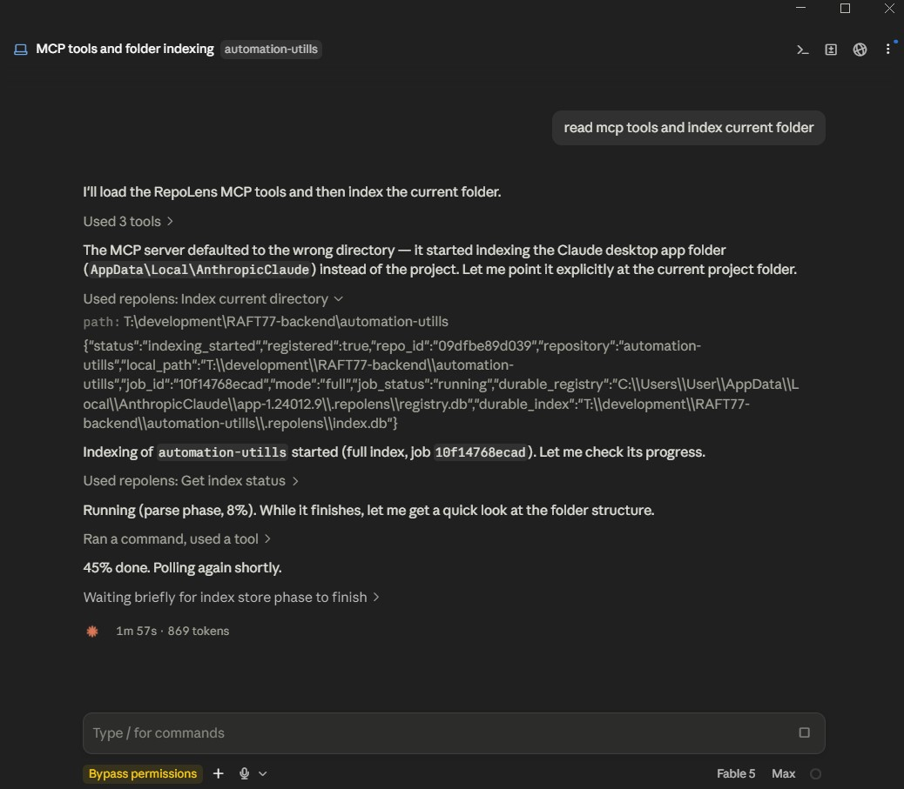
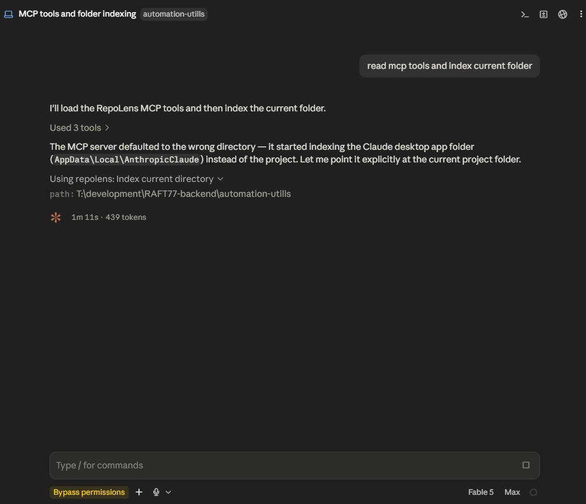

# RepoLens

<div align="center">

### Repository intelligence for AI coding agents

Turn a local codebase into a queryable AST, symbol index, knowledge graph, and
token-efficient context layer—without sending your source code to a hosted indexing service.

[](https://github.com/ashu2012/RepoLens)

[](https://www.python.org/)
[](https://modelcontextprotocol.io/)
[](LICENSE)
[](ROADMAP.md)
[](https://github.com/ashu2012/RepoLens/releases/latest)

[⭐ Star RepoLens](https://github.com/ashu2012/RepoLens) ·
[🚀 Try it locally](#quick-start) ·
[🧩 Pick a contribution](https://github.com/ashu2012/RepoLens/issues) ·
[💬 Start a discussion](https://github.com/ashu2012/RepoLens/discussions)

[Quick start](#quick-start) · [How it works](#how-it-works) ·
[Documentation](#documentation) · [Roadmap](ROADMAP.md) ·
[Contributing](CONTRIBUTING.md)

</div>

---

AI coding tools are excellent at reasoning about code once they have the right context.
Finding that context is the expensive part. RepoLens scans a repository once, extracts its
structure with Tree-sitter, and stores durable local indexes that tools can query instead of
re-reading the entire tree for every task.

## Download for Windows

Download the ready-to-run files from the
[latest GitHub Release](https://github.com/ashu2012/RepoLens/releases/latest):

- **`RepoLens-<version>-Setup-x64.exe`** — recommended guided installer.
- **`RepoLens.exe`** — portable version with no Python installation required.
- **`SHA256SUMS.txt`** — download verification hashes.

The quickest path is:

1. Open the latest release page.
2. Under Assets, download `RepoLens-<version>-Setup-x64.exe` for the guided installer or
   `RepoLens.exe` for a portable build.
3. Keep `SHA256SUMS.txt` with the download and verify the checksum before running it.

The installer initializes RepoLens, starts the local daemon, creates dashboard
shortcuts, and opens `http://127.0.0.1:38451/dashboard`. It does not modify
Claude, Codex, Cursor, VS Code, or other AI-client configuration files.

See [Downloads and releases](docs/releases.md) for verification, portable setup,
release creation, and local installer build instructions.

> [!IMPORTANT]
> RepoLens is in early access. AST indexing, symbol chunking, local graph persistence, the Web
> dashboard, and core context utilities are available. Semantic retrieval, incremental updates,
> and several MCP tools are under active development. See the [honest feature status](#status)
> before adopting it in production.

## Built in the open

RepoLens is growing from an early working foundation into a community-built repository
intelligence layer. The project is actively looking for its first wave of users and contributors:

- Try RepoLens on a real repository and report the language, scale, and indexing result.
- Help connect persisted chunks to BM25, vectors, and MCP tools.
- Add parser fixtures for your language ecosystem.
- Improve the dashboard, documentation, packaging, and developer experience.

**Community milestone:** help RepoLens reach its first 100 stars and 10 contributors. This is a
public goal—not a claim about current growth.

## Community and support

If RepoLens is useful to you, a small bit of support helps keep the project moving:

- Join the Discord community: [discord.gg/RveEysUvF](https://discord.gg/RveEysUvF)
- Donate with PayPal: [paypal.me/stocknap](https://www.paypal.com/paypalme/stocknap)
- Scan the UPI QR code below or use `zerodha5200@hsbc` in any UPI app

<p align="center">
  
</p>

## Who RepoLens helps

| Audience | Hooks | What they get |
|---|---|---|
| Technical users | CLI, MCP, REST API, source builds | local AST search, graph traversal, automation, and repeatable workflows |
| Non-technical users | One-click installer, dashboard, release assets | no Python setup, visible status, safer downloads, and a simple UI |
| Teams | Shared registry, release checksums, portable EXE | less setup friction and easier support across machines |

RepoLens hooks into the places people already work:

- Your shell, through `repolens` commands
- Your AI assistant, through MCP
- Your browser, through the local dashboard

## Why RepoLens?

- **Code-aware, not text-only.** Index classes, functions, methods, imports, calls, and symbol
  boundaries rather than arbitrary fixed-size text windows.
- **Local by default.** The AST graph and chunks live in `.repolens/index.db` inside the indexed
  repository.
- **Built for agents.** Expose compact, relevant context through REST, CLI, and the Model Context
  Protocol.
- **Observable.** Inspect repository registration, indexing progress, result counts, failures,
  health, and pipeline metrics from one dashboard.
- **Provider-flexible.** Use local Ollama embeddings, OpenAI, or a deterministic mock provider
  during development.

## Quick start

The bootstrap, IPC, and installer lifecycle is complete:

```bash
repolens init
repolens daemon
repolens dashboard
repolens mcp-config codex
repolens diagnostics
```

Initialization is atomic and user-scoped. A cross-platform lock and ZeroMQ
health endpoint enforce one daemon per user. MCP snippets use the actual
installation path and are never written to client configuration automatically.

Prerequisites: Python 3.11+ and Git.

```bash
git clone https://github.com/ashu2012/RepoLens.git
cd RepoLens/repolens

python -m venv .venv
# Windows: .venv\Scripts\activate
# macOS/Linux: source .venv/bin/activate

python -m pip install -e .
repolens serve
```

Open [http://127.0.0.1:38451/dashboard](http://127.0.0.1:38451/dashboard), add a local repository,
and choose **Full index**. A successful run reports the real number of files, symbols, and edges
written to `<repository>/.repolens/index.db`; zero-output parsing is treated as a failure.

Run the test suite:

```bash
python -m pip install pytest pytest-asyncio
python -m pytest
```

## How it works

```text
Local repository
      │
      ├─ discover supported source files
      ├─ parse syntax with Tree-sitter
      ├─ extract symbols, imports, and calls
      ├─ create symbol-aligned source chunks
      └─ persist graph + chunks in SQLite
                 │
        Search / context / MCP / dashboard
```

RepoLens currently recognizes Python, JavaScript, TypeScript, Go, Rust, Java, C, C++, Ruby,
Kotlin, C#, PHP, Swift, Scala, and shell files through `tree-sitter-language-pack`.

## Status

| Capability | Status | Notes |
|---|:---:|---|
| Repository registration and Web controls | ✅ | Local paths, full-index trigger, progress, cancellation |
| Multi-language AST indexing | ✅ | Tree-sitter symbols, imports, and call expressions |
| Symbol-aligned chunks | ✅ | Source content and symbol metadata persisted in SQLite |
| Knowledge graph persistence | ✅ | Nodes, edges, and chunks in `.repolens/index.db` |
| Context distillation and token budgets | ✅ | Skeleton and budget utilities with tests |
| Dashboard and health probes | ✅ | FastAPI dashboard plus health/metrics endpoints |
| BM25 and vector retrieval | ✅ | Persisted chunks, offline vectors, and hybrid RRF |
| Semantic/hybrid search API | ✅ | Repository-scoped REST search over the durable index |
| MCP server | ✅ | Concurrent search/context tools, async indexing, durable jobs, and session reindexing |
| Incremental indexing | ✅ | File-hash updates with added, modified, and deleted file handling |
| Persistent repository registry/jobs | ✅ | Durable SQLite server state and job history |
| Architecture intelligence/GraphRAG | 📋 | Planned |

Legend: ✅ usable · 🧪 experimental · 🚧 in progress · 📋 planned

## Use RepoLens with AI coding tools

RepoLens runs as a local stdio MCP server. Install it first and index at least one repository
from the Web dashboard:

```bash
cd /absolute/path/to/RepoLens/repolens
python -m pip install -e .
python -m repolens serve
```

The MCP server now includes repository intelligence tools plus basic workspace file operations
such as listing, reading, writing, moving, and deleting files and folders. See
[MCP and REST API](docs/mcp-api.md) for the full tool list and the HTTP bridge.

All clients must use the same `REPOLENS_DATA_DIR` as the Web server so they can find its persistent
repository registry. In the examples below, replace both absolute paths with paths on your
machine:

```text
Python:   /absolute/path/to/RepoLens/repolens/.venv/bin/python
Windows:  C:\absolute\path\to\RepoLens\repolens\.venv\Scripts\python.exe
Data:     /absolute/path/to/RepoLens/repolens/.repolens
```

Using the virtual environment's full Python path is the most reliable option. If `python` already
resolves to the environment where RepoLens is installed, you can use `"python"` instead.

### Example: Claude with local, token-efficient context

Configure Claude Desktop to launch RepoLens as an MCP server. The screenshot below shows the
minimal command shape; use the absolute virtual-environment path and shared `REPOLENS_DATA_DIR`
described above for a reliable setup.

<p align="center">
  
</p>

Ask Claude to load the RepoLens MCP tools and index the current project. RepoLens parses the
project locally and persists its repository index under `.repolens`, so source code does not need
to be uploaded to a hosted indexing service.

<p align="center">
  
</p>

Once indexed, Claude can request focused symbols, relationships, and budgeted context from
RepoLens instead of repeatedly reading large files or scanning the entire repository. This can
reduce the amount of repository text placed into the model context, especially across repeated
questions about the same codebase. Actual savings depend on the query, repository, client, and
selected context budget; the token count shown here is Claude's client-reported usage for this
example, not a guaranteed benchmark.

<p align="center">
  
</p>

### Claude Code

Add RepoLens to the current project:

```bash
claude mcp add --transport stdio --scope project \
  --env REPOLENS_DATA_DIR=/absolute/path/to/RepoLens/repolens/.repolens \
  repolens -- /absolute/path/to/RepoLens/repolens/.venv/bin/python -m repolens mcp
```

On Windows PowerShell:

```powershell
claude mcp add --transport stdio --scope project `
  --env REPOLENS_DATA_DIR=C:\absolute\path\to\RepoLens\repolens\.repolens `
  repolens -- C:\absolute\path\to\RepoLens\repolens\.venv\Scripts\python.exe -m repolens mcp
```

Alternatively, create `.mcp.json` in the project:

```json
{
  "mcpServers": {
    "repolens": {
      "type": "stdio",
      "command": "T:\\development\\RepoLens\\repolens\\.venv\\Scripts\\repolens.exe",
      "args": ["mcp"],
      "cwd": "T:\\development"
    }
  }
}
```

Run `claude mcp list` to verify registration, then use `/mcp` inside Claude Code to inspect the
connection. See the official [Claude Code MCP documentation](https://docs.anthropic.com/en/docs/claude-code/mcp).

### OpenAI Codex

Add RepoLens from the Codex CLI:

```bash
codex mcp add repolens \
  --env REPOLENS_DATA_DIR=/absolute/path/to/RepoLens/repolens/.repolens \
  -- /absolute/path/to/RepoLens/repolens/.venv/bin/python -m repolens mcp
```

Or add it to Codex configuration:

```toml
[mcp_servers.repolens]
command = "/absolute/path/to/RepoLens/repolens/.venv/bin/python"
args = ["-m", "repolens", "mcp"]

[mcp_servers.repolens.env]
REPOLENS_DATA_DIR = "/absolute/path/to/RepoLens/repolens/.repolens"
```

Use project-level `.codex/config.toml` when the server should apply only to one trusted
repository, or your Codex user configuration when it should be available across projects. Restart
Codex after changing the file. Run `codex mcp list` to verify registration, then ask it to list
indexed repositories with RepoLens.

### VS Code

Recent VS Code versions support MCP servers in workspace-level `.vscode/mcp.json`. Create:

```json
{
  "servers": {
    "repolens": {
      "type": "stdio",
      "command": "/absolute/path/to/RepoLens/repolens/.venv/bin/python",
      "args": ["-m", "repolens", "mcp"],
      "env": {
        "REPOLENS_DATA_DIR": "/absolute/path/to/RepoLens/repolens/.repolens"
      }
    }
  }
}
```

Open the Command Palette and run **MCP: List Servers**, select `repolens`, and start it. The first
start may show a trust confirmation. If tools changed after an update, run
**MCP: Reset Cached Tools** and restart the server. See the official
[VS Code MCP server guide](https://code.visualstudio.com/docs/agent-customization/mcp-servers).

### Verify the connection

Ask the client:

```text
Use RepoLens to list indexed repositories. If this workspace is missing, call
index_current_directory with the repository path and mode "auto", then monitor
get_index_status until it completes. Then search for "PipelineOrchestrator" and
return its file path and callers.
```

The client should invoke `list_repos`, optionally `index_current_directory` and
`get_index_status`, then `search_symbols` and optionally `find_callers`.
Indexing is asynchronous: the initial call returns a durable job ID rather than
holding the MCP request open. When more than one repository is indexed, include
the returned `repo_id` in subsequent tool calls. If `index_current_directory`
is called without a path, RepoLens falls back to its own package directory
instead of the server process cwd.

RepoLens records MCP session activity and schedules an incremental index for 10 minutes after the
most recent tool call. Continued activity moves that deadline forward. The schedule and job state
are stored in `REPOLENS_DATA_DIR`, so another RepoLens process can recover due or abandoned work
after restart.

You can test the same tools without an MCP client from the local
[OpenAPI page](http://127.0.0.1:38451/api/docs) using `GET /api/mcp/tools` and
`POST /api/mcp/call`.

The MCP surface includes hybrid search, symbol search, budgeted context assembly, callers/callees,
recent changes, architecture, health, and asynchronous workspace indexing. Blocking query work and
AST indexing use separate bounded thread pools, keeping concurrent MCP calls responsive. By default
RepoLens uses deterministic offline vectors.
Set `REPOLENS_EMBEDDING_PROVIDER=ollama` to use a local semantic embedding model; see the
[indexing guide](docs/indexing.md).

### Troubleshooting

- **Server exits immediately:** use the absolute Python executable from the RepoLens virtual
  environment.
- **No repositories returned:** confirm the MCP process and Web server use the same absolute
  `REPOLENS_DATA_DIR`.
- **Tools are missing:** restart the client or clear its cached MCP tools.
- **Permission error:** the MCP process must be able to read the registered repository and its
  `.repolens/index.db`.
- **Multiple repositories:** call `list_repos` first and pass the desired `repo_id`.

## Project layout

```text
RepoLens/
├── repolens/                 # Installable Python application
│   ├── src/repolens/
│   │   ├── core/             # Ingestion, graph, search, providers, pipeline
│   │   ├── server/           # REST API, Web UI, MCP, scheduler
│   │   ├── observability/    # Metrics, health, pipeline and RAG monitors
│   │   └── cli/              # Command-line interface
│   ├── templates/            # Self-hosted dashboard
│   └── tests/
├── docs/                     # User and contributor documentation
├── implementation_plan.md    # Original technical blueprint
└── ROADMAP.md                # Current delivery status and priorities
```

The other top-level directories are research/reference projects used to study code intelligence,
RAG, architecture, observability, and agent tooling. RepoLens itself lives in `repolens/`.

## Documentation

- [Getting started](docs/getting-started.md)
- [Downloads, releases, and installer builds](docs/releases.md)
- [Indexing pipeline](docs/indexing.md)
- [MCP and REST API](docs/mcp-api.md)
- [Architecture](ARCHITECTURE.md)
- [Roadmap](ROADMAP.md)
- [Package README and build notes](repolens/README.md)
- [FAQ](docs/faq.md)
- [Benchmarks](docs/benchmarks.md)
- [Contributing](CONTRIBUTING.md)
- [Security policy](SECURITY.md)

## Contributing

RepoLens is a good fit for contributors interested in compilers, Tree-sitter, information
retrieval, knowledge graphs, developer tools, MCP, or observability. A useful first contribution
can be a parser fixture, a search integration test, documentation, a dashboard improvement, or
one of the open roadmap items.

Please read [CONTRIBUTING.md](CONTRIBUTING.md) before starting a large change. If the project is
useful to you, star it, open an issue with your use case, and share an indexing fixture from your
language ecosystem.

### Contributors

Every avatar below is generated from the repository's real GitHub contribution history.

<a href="https://github.com/ashu2012/RepoLens/graphs/contributors">
  
</a>

### Star history

This chart uses public GitHub data and updates as the community grows.

[](https://star-history.com/#ashu2012/RepoLens&Date)

## License

RepoLens is licensed under the [Apache License 2.0](LICENSE).
