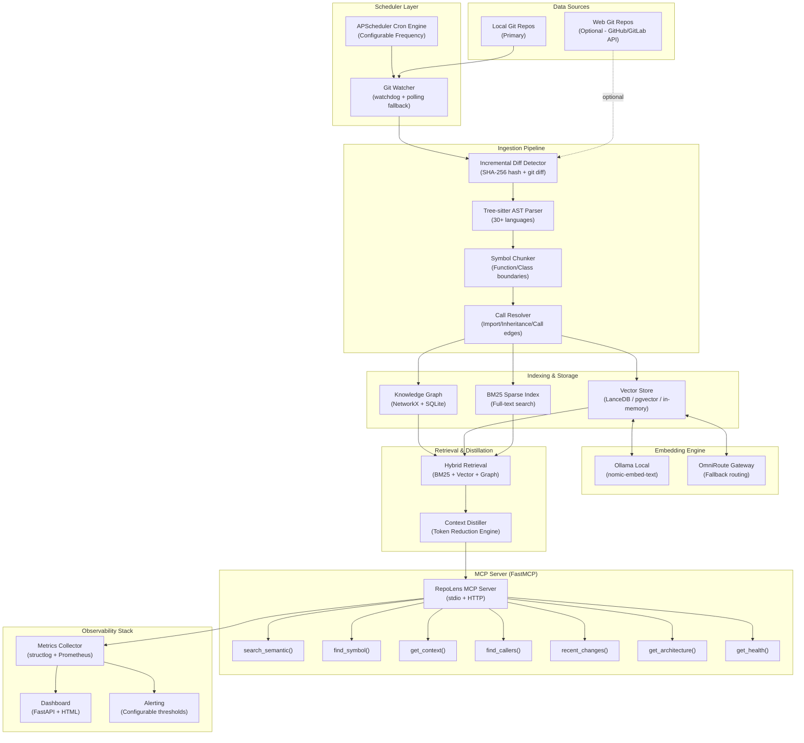

# RepoLens — Local Code RAG, MCP Server, Semantic Search & Token Reduction

> Build a unified local-first code intelligence platform that indexes git repositories, exposes semantic search over MCP, reduces LLM token consumption by 90%+, runs on configurable cron schedules, and provides full observability of RAG and MCP server performance.

## Architecture Overview



---

## Source Mapping: What We Take From Each Reference Project

| Reference Project | What We Extract | Target RepoLens Module |
| :--- | :--- | :--- |
| **`repowise`** | Pipeline orchestrator, incremental indexer, vector store (LanceDB/pgvector), embedding providers (Ollama/OpenAI/Gemini), distillation engine, APScheduler cron, FastAPI server, MCP server tools | `core/pipeline/`, `core/ingestion/`, `core/persistence/`, `core/providers/`, `core/distill/`, `server/` |
| **`code-review-graph`** | Tree-sitter AST parser (30+ langs), incremental git diff (SHA-256), blast-radius expansion, FastMCP server, context savings calculator, auto-installer for 15 AI platforms | `core/parser.py`, `core/incremental.py`, `server/mcp/`, `installer/` |
| **`graphify`** | NetworkX knowledge graph builder, Leiden community detection, symbol resolution, call graph traversal, graph query/explain/path CLI, interactive HTML graph export | `core/graph/`, `core/analysis/` |
| **`samemind`** | Zero-dependency BM25 engine (Robertson-Sparck-Jones IDF), hybrid recall dispatcher (auto/bm25/semantic/hybrid), flat-JSON + SQLite vector index, MCP JSON-RPC server | `core/search/bm25.py`, `core/search/hybrid.py` |
| **`OmniRoute`** | Embedding routing with family guard (dimension safety), multi-provider fallback chains, local model auto-detection (Ollama/LM Studio), OpenAI-compatible API gateway | `core/providers/embedding/router.py` |
| **`AIUsageTracker`** | Token usage math engine, burn-rate forecasting, pace badges, quota tracking, cost estimation | `observability/metrics.py`, `observability/token_tracker.py` |
| **`open-webui`** | RAG UI patterns, document ingestion pipeline, hybrid search (BM25 + dense + reranking), knowledge base management | `server/ui/` (optional dashboard) |
| **`likec4`** | Architecture-as-code visualization, C4 diagram export | `server/tools/architecture.py` (visualization export) |

---

## Project Structure

```
T:\development\RepoLens\repolens\
├── pyproject.toml                    # [NEW] Unified package config
├── .env.example                      # [NEW] Configuration template
├── config.yaml                       # [NEW] Cron schedules, repo list, thresholds
├── docker-compose.yml                # [NEW] Optional PostgreSQL + Ollama
├── README.md                         # [NEW] Documentation
│
├── src/repolens/
│   ├── __init__.py
│   ├── __main__.py                   # [NEW] CLI entry point
│   │
│   ├── core/                         # === CORE ENGINE ===
│   │   ├── __init__.py
│   │   ├── config.py                 # [NEW] Pydantic settings from config.yaml/.env
│   │   │
│   │   ├── ingestion/                # From: repowise + code-review-graph
│   │   │   ├── __init__.py
│   │   │   ├── git_watcher.py        # Git polling + watchdog filesystem events
│   │   │   ├── diff_detector.py      # SHA-256 content hashing, git diff --name-only
│   │   │   ├── parser.py             # Tree-sitter AST parser (30+ languages)
│   │   │   ├── chunker.py            # Symbol-boundary chunking (not token-count)
│   │   │   ├── call_resolver.py      # Import/call/inheritance edge resolution
│   │   │   └── models.py             # NodeInfo, EdgeInfo, ChunkInfo dataclasses
│   │   │
│   │   ├── graph/                    # From: graphify + repowise
│   │   │   ├── __init__.py
│   │   │   ├── builder.py            # NetworkX DiGraph assembly from AST extractions
│   │   │   ├── store.py              # SQLite graph persistence (nodes/edges tables)
│   │   │   ├── query.py              # Callers, callees, imports, inheritors, BFS/DFS
│   │   │   ├── community.py          # Leiden community detection (graspologic)
│   │   │   └── analysis.py           # Hub nodes, bridge nodes, god nodes, architecture
│   │   │
│   │   ├── search/                   # From: samemind + code-review-graph
│   │   │   ├── __init__.py
│   │   │   ├── bm25.py               # Zero-dep BM25 (Robertson-Sparck-Jones IDF)
│   │   │   ├── vector.py             # Dense vector cosine similarity search
│   │   │   └── hybrid.py             # Hybrid dispatcher: BM25 + vector + graph rerank
│   │   │
│   │   ├── providers/                # From: repowise + OmniRoute
│   │   │   ├── __init__.py
│   │   │   ├── base.py               # Abstract EmbeddingProvider interface
│   │   │   ├── ollama.py             # Ollama nomic-embed-text (primary local)
│   │   │   ├── openai.py             # OpenAI text-embedding-3-small (cloud fallback)
│   │   │   ├── gemini.py             # Google Gemini embeddings (cloud fallback)
│   │   │   ├── router.py             # Auto-detect local → cloud fallback routing
│   │   │   └── dimension_guard.py    # OmniRoute dimension safety check
│   │   │
│   │   ├── persistence/              # From: repowise
│   │   │   ├── __init__.py
│   │   │   ├── database.py           # SQLAlchemy async engine (SQLite default / Postgres)
│   │   │   ├── models.py             # ORM: Repository, Symbol, Chunk, Embedding, Job
│   │   │   ├── crud.py               # CRUD operations
│   │   │   └── vector_store/
│   │   │       ├── base.py           # Abstract VectorStore interface
│   │   │       ├── lancedb_store.py  # LanceDB (default zero-infra)
│   │   │       ├── pgvector_store.py # PostgreSQL pgvector (production)
│   │   │       └── in_memory.py      # In-memory for testing
│   │   │
│   │   ├── distill/                  # From: repowise + code-review-graph
│   │   │   ├── __init__.py
│   │   │   ├── skeleton.py           # Code skeleton generator (strip bodies, keep sigs)
│   │   │   ├── context_builder.py    # Blast-radius context assembly
│   │   │   ├── token_estimator.py    # Token counting (4 chars/token heuristic + tiktoken)
│   │   │   └── budget.py             # Token budget enforcement
│   │   │
│   │   └── pipeline/                 # From: repowise
│   │       ├── __init__.py
│   │       ├── orchestrator.py       # Full pipeline: detect→parse→chunk→embed→store
│   │       ├── incremental.py        # Incremental pipeline (only changed files)
│   │       ├── checkpoint.py         # Resume from last successful phase
│   │       └── progress.py           # Progress tracking with callbacks
│   │
│   ├── server/                       # === SERVER LAYER ===
│   │   ├── __init__.py
│   │   ├── app.py                    # FastAPI application factory
│   │   ├── scheduler.py              # APScheduler cron job manager
│   │   │
│   │   ├── mcp/                      # From: code-review-graph + repowise
│   │   │   ├── __init__.py
│   │   │   ├── server.py             # FastMCP server (stdio + HTTP transports)
│   │   │   ├── tool_search.py        # search_semantic(), search_symbol()
│   │   │   ├── tool_context.py       # get_context(), fetch_context()
│   │   │   ├── tool_graph.py         # find_callers(), find_callees(), query_graph()
│   │   │   ├── tool_changes.py       # recent_changes(), detect_changes()
│   │   │   ├── tool_architecture.py  # get_architecture(), get_communities()
│   │   │   └── tool_health.py        # get_health(), get_stats()
│   │   │
│   │   ├── api/                      # REST API endpoints
│   │   │   ├── __init__.py
│   │   │   ├── repos.py              # CRUD repos, trigger indexing
│   │   │   ├── search.py             # Search API
│   │   │   └── jobs.py               # Pipeline job status
│   │   │
│   │   └── installer/                # From: code-review-graph
│   │       ├── __init__.py
│   │       └── platforms.py          # Auto-detect & configure 15 AI platforms
│   │
│   ├── observability/                # === MONITORING & METRICS ===
│   │   ├── __init__.py
│   │   ├── metrics.py                # Prometheus-compatible metrics registry
│   │   ├── token_tracker.py          # Per-request token savings tracking
│   │   ├── pipeline_monitor.py       # Pipeline execution time, phase durations
│   │   ├── mcp_monitor.py            # MCP tool call latency, error rates, throughput
│   │   ├── rag_monitor.py            # Retrieval quality: precision, recall, hit rate
│   │   ├── health.py                 # Liveness & readiness probes
│   │   └── dashboard.py             # Self-hosted HTML dashboard (Jinja2 templates)
│   │
│   └── cli/                          # === CLI ===
│       ├── __init__.py
│       ├── main.py                   # Click CLI: init, index, serve, search, status, install
│       └── commands/
│           ├── init.py               # Initialize config + database
│           ├── index.py              # Trigger full/incremental indexing
│           ├── serve.py              # Start MCP + API server
│           ├── search.py             # CLI search command
│           ├── status.py             # Show index stats, health, cron status
│           └── install.py            # Auto-install MCP config for AI platforms
│
├── templates/                        # Jinja2 templates for dashboard
│   └── dashboard.html
│
├── tests/
│   ├── unit/
│   │   ├── test_parser.py
│   │   ├── test_bm25.py
│   │   ├── test_chunker.py
│   │   ├── test_hybrid_search.py
│   │   ├── test_distill.py
│   │   └── test_token_estimator.py
│   └── integration/
│       ├── test_pipeline.py
│       ├── test_mcp_server.py
│       └── test_scheduler.py
│
└── docs/
    ├── QUICKSTART.md
    ├── CONFIGURATION.md
    ├── MCP_TOOLS.md
    └── OBSERVABILITY.md
```

---

## Proposed Changes

### Phase 1: Project Scaffold & Configuration

#### [NEW] `pyproject.toml`
- Python ≥3.11, build with setuptools
- Core deps: `tree-sitter` + language packs, `networkx`, `sqlalchemy[asyncio]`, `aiosqlite`, `lancedb`, `fastapi`, `uvicorn`, `mcp`, `fastmcp`, `apscheduler`, `watchdog`, `structlog`, `click`, `rich`, `pydantic`, `httpx`, `gitpython`, `jinja2`, `pathspec`, `tenacity`
- Optional: `pgvector` + `asyncpg` (postgres), `graspologic` (communities), `sentence-transformers` (local embeddings), `prometheus-client` (metrics)
- Entry point: `repolens = "repolens.cli.main:cli"`

#### [NEW] `config.yaml`
```yaml
repositories:
  - path: "T:/development/rachana-finance-website"
    name: "rachana-finance"
    branch: "main"
  - path: "T:/development/android_sms_application"
    name: "sms-app"

scheduler:
  full_index_cron: "0 2 * * *"        # Full re-index daily at 2 AM
  incremental_cron: "*/15 * * * *"    # Incremental every 15 minutes
  polling_interval_minutes: 15
  staleness_check_minutes: 30

embedding:
  provider: "ollama"                   # ollama | openai | gemini | auto
  model: "nomic-embed-text"
  fallback_provider: "openai"
  dimension: 768

vector_store:
  backend: "lancedb"                   # lancedb | pgvector | memory
  path: ".repolens/vectors"

database:
  url: "sqlite+aiosqlite:///.repolens/repolens.db"

server:
  host: "127.0.0.1"
  port: 8420
  mcp_transport: "stdio"               # stdio | http

observability:
  enable_prometheus: true
  metrics_port: 9090
  enable_dashboard: true
  log_level: "INFO"
  alert_thresholds:
    mcp_latency_p95_ms: 2000
    pipeline_duration_warn_s: 300
    embedding_error_rate_pct: 5
```

---

### Phase 2: Core Ingestion Pipeline

#### [NEW] `src/repolens/core/ingestion/parser.py`
- **Adapt from**: [code-review-graph/parser.py](file:///T:/development/RepoLens/code-review-graph/code_review_graph/parser.py) + [repowise/ingestion/parser.py](file:///T:/development/RepoLens/repowise/packages/core/src/repowise/core/ingestion/parser.py)
- Tree-sitter multi-language AST parser
- Extract `NodeInfo` (kind, name, file, lines, params, return_type) and `EdgeInfo` (CALLS, IMPORTS_FROM, INHERITS, CONTAINS)
- Support 30+ languages via `tree-sitter-language-pack`

#### [NEW] `src/repolens/core/ingestion/diff_detector.py`
- **Adapt from**: [code-review-graph/incremental.py](file:///T:/development/RepoLens/code-review-graph/code_review_graph/incremental.py) + [repowise/ingestion/change_detector.py](file:///T:/development/RepoLens/repowise/packages/core/src/repowise/core/ingestion/change_detector.py)
- `git diff --name-only` for changed files
- SHA-256 content hashing to skip unchanged files
- Blast-radius dependent expansion (2-hop reverse dependencies)

#### [NEW] `src/repolens/core/ingestion/chunker.py`
- **Adapt from**: [repowise/ingestion/traverser.py](file:///T:/development/RepoLens/repowise/packages/core/src/repowise/core/ingestion/traverser.py)
- Chunk code by AST symbol boundaries (functions, classes, methods)
- Never split a function across chunks
- Attach metadata: file path, line range, symbol name, language

#### [NEW] `src/repolens/core/ingestion/call_resolver.py`
- **Adapt from**: [repowise/ingestion/call_resolver.py](file:///T:/development/RepoLens/repowise/packages/core/src/repowise/core/ingestion/call_resolver.py) + [graphify/extractors/resolution.py](file:///T:/development/RepoLens/graphify/graphify/extractors/resolution.py)
- Resolve imports to actual file definitions
- Build caller→callee edges across files
- Confidence tagging: `EXTRACTED` vs `INFERRED`

---

### Phase 3: Knowledge Graph & Search

#### [NEW] `src/repolens/core/graph/builder.py`
- **Adapt from**: [graphify/build.py](file:///T:/development/RepoLens/graphify/graphify/build.py) + [code-review-graph/graph.py](file:///T:/development/RepoLens/code-review-graph/code_review_graph/graph.py)
- Assemble AST extractions into NetworkX DiGraph
- Node types: File, Class, Function, Type, Test
- Edge types: CALLS, IMPORTS_FROM, INHERITS, IMPLEMENTS, CONTAINS, TESTED_BY
- SQLite-backed persistence with indexed node/edge tables

#### [NEW] `src/repolens/core/search/bm25.py`
- **Adapt from**: [samemind/tools/lib/bm25.mjs](file:///T:/development/RepoLens/samemind/tools/lib/bm25.mjs) — rewrite in Python
- Robertson-Sparck-Jones IDF with +1 smoothing
- BM25 scoring with k1=1.2, b=0.75
- Unicode-aware tokenizer

#### [NEW] `src/repolens/core/search/vector.py`
- **Adapt from**: [repowise/persistence/vector_store/](file:///T:/development/RepoLens/repowise/packages/core/src/repowise/core/persistence/vector_store)
- Abstract `VectorStore` interface
- LanceDB implementation (default, zero-infra)
- pgvector implementation (production)
- In-memory cosine similarity (testing)

#### [NEW] `src/repolens/core/search/hybrid.py`
- **Adapt from**: [samemind/tools/lib/recall.mjs](file:///T:/development/RepoLens/samemind/tools/lib/recall.mjs) + [repowise/server/search_helpers.py](file:///T:/development/RepoLens/repowise/packages/server/src/repowise/server/search_helpers.py)
- Reciprocal Rank Fusion (RRF) to merge BM25 + vector results
- Optional graph-neighbor reranking boost
- Configurable mode: `auto` | `bm25` | `semantic` | `hybrid`

---

### Phase 4: Embedding Provider Router

#### [NEW] `src/repolens/core/providers/router.py`
- **Adapt from**: [repowise/providers/embedding/registry.py](file:///T:/development/RepoLens/repowise/packages/core/src/repowise/core/providers/embedding/registry.py) + [OmniRoute embedding routing](file:///T:/development/RepoLens/OmniRoute/src/lib/embeddings)
- Auto-detect local Ollama at `http://127.0.0.1:11434`
- Fallback chain: Ollama → OpenAI → Gemini
- Dimension guard: reject model switches that change embedding dimensions mid-index

---

### Phase 5: Context Distillation & Token Reduction

#### [NEW] `src/repolens/core/distill/skeleton.py`
- **Adapt from**: [repowise/distill/skeleton.py](file:///T:/development/RepoLens/repowise/packages/core/src/repowise/core/distill/skeleton.py)
- Generate code skeletons: keep signatures, strip function bodies
- Reduce a 500-line file to ~50 lines of structural outline

#### [NEW] `src/repolens/core/distill/context_builder.py`
- **Adapt from**: [repowise/mcp_server/_answer_context.py](file:///T:/development/RepoLens/repowise/packages/server/src/repowise/server/mcp_server/_answer_context.py) + [code-review-graph context_savings.py](file:///T:/development/RepoLens/code-review-graph/code_review_graph/context_savings.py)
- Build task-oriented context: target function + callers + callees + compressed file outline
- Token budget enforcement (default 4000 tokens)
- Report token savings vs raw file read

---

### Phase 6: MCP Server

#### [NEW] `src/repolens/server/mcp/server.py`
- **Adapt from**: [code-review-graph/main.py](file:///T:/development/RepoLens/code-review-graph/code_review_graph/main.py) (FastMCP setup) + [repowise/server/mcp_server/_server.py](file:///T:/development/RepoLens/repowise/packages/server/src/repowise/server/mcp_server/_server.py)
- FastMCP server with stdio + HTTP transports
- 10 exposed tools (see MCP Tools below)
- Async `asyncio.to_thread` for long-running operations
- Windows `WindowsSelectorEventLoopPolicy` compatibility

**MCP Tools (10 total):**

| Tool | Description | Source Reference |
| :--- | :--- | :--- |
| `search_semantic(query, top_k)` | Hybrid BM25 + vector search | samemind + repowise |
| `search_symbols(name, kind)` | Fast AST symbol lookup | code-review-graph |
| `get_context(targets, budget)` | Token-reduced context bundle | repowise distill |
| `find_callers(symbol)` | Reverse call graph traversal | graphify + CRG |
| `find_callees(symbol)` | Forward call graph traversal | graphify + CRG |
| `query_graph(pattern, target)` | 15 graph query patterns | code-review-graph |
| `recent_changes(since)` | Git diff context since commit/time | CRG incremental |
| `get_architecture()` | Community-based architecture overview | graphify + CRG |
| `get_health()` | Index stats, staleness, coverage | repowise |
| `list_repos()` | List indexed repositories | repowise |

---

### Phase 7: Cron Scheduler & Pipeline Orchestration

#### [NEW] `src/repolens/server/scheduler.py`
- **Adapt from**: [repowise/server/scheduler.py](file:///T:/development/RepoLens/repowise/packages/server/src/repowise/server/scheduler.py)
- APScheduler `AsyncIOScheduler` with configurable cron expressions
- Three recurring jobs:
  1. **Incremental Index** (`*/15 * * * *` default): Detect changed files, re-parse, update graph + vectors
  2. **Full Re-index** (`0 2 * * *` default): Complete repository re-scan
  3. **Staleness Check** (`*/30 * * * *` default): Flag stale index entries
- Git HEAD polling fallback (compare stored commit SHA vs current HEAD)
- Job deduplication: skip if identical job already pending/running

#### [NEW] `src/repolens/core/pipeline/orchestrator.py`
- **Adapt from**: [repowise/pipeline/orchestrator.py](file:///T:/development/RepoLens/repowise/packages/core/src/repowise/core/pipeline/orchestrator.py)
- Phase-based execution: `detect → parse → chunk → resolve → embed → store → analyze`
- Checkpoint/resume support (restart from last successful phase on failure)
- Progress callbacks for observability integration
- Parallel file parsing via `ThreadPoolExecutor`

---

### Phase 8: Observability & Monitoring

#### [NEW] `src/repolens/observability/metrics.py`
- **Inspired by**: [AIUsageTracker](file:///T:/development/RepoLens/AIUsageTracker) metrics + [repowise pipeline/phase_timing.py](file:///T:/development/RepoLens/repowise/packages/core/src/repowise/core/pipeline/phase_timing.py)
- Prometheus-compatible metrics via `prometheus_client`:

```python
# Pipeline Metrics
pipeline_runs_total        = Counter("repolens_pipeline_runs_total", "Total pipeline executions", ["mode", "status"])
pipeline_duration_seconds  = Histogram("repolens_pipeline_duration_seconds", "Pipeline execution time", ["mode", "phase"])
files_indexed_total        = Counter("repolens_files_indexed_total", "Files processed")
symbols_extracted_total    = Counter("repolens_symbols_extracted_total", "AST symbols extracted")

# MCP Server Metrics
mcp_tool_calls_total       = Counter("repolens_mcp_tool_calls_total", "MCP tool invocations", ["tool_name", "status"])
mcp_tool_latency_seconds   = Histogram("repolens_mcp_tool_latency_seconds", "MCP tool response time", ["tool_name"])
mcp_active_connections     = Gauge("repolens_mcp_active_connections", "Active MCP client connections")

# RAG Quality Metrics
search_queries_total       = Counter("repolens_search_queries_total", "Search queries processed", ["mode"])
search_latency_seconds     = Histogram("repolens_search_latency_seconds", "Search response time", ["mode"])
search_results_count       = Histogram("repolens_search_results_count", "Results returned per query")

# Token Reduction Metrics
tokens_saved_total         = Counter("repolens_tokens_saved_total", "Tokens saved by distillation")
token_reduction_ratio      = Histogram("repolens_token_reduction_ratio", "Compression ratio per request")
context_budget_utilization = Histogram("repolens_context_budget_utilization", "Fraction of token budget used")

# Embedding Metrics
embedding_requests_total   = Counter("repolens_embedding_requests_total", "Embedding API calls", ["provider", "status"])
embedding_latency_seconds  = Histogram("repolens_embedding_latency_seconds", "Embedding generation time", ["provider"])

# System Health
index_staleness_seconds    = Gauge("repolens_index_staleness_seconds", "Seconds since last successful index", ["repo"])
vector_store_size          = Gauge("repolens_vector_store_size", "Number of vectors in store", ["repo"])
graph_node_count           = Gauge("repolens_graph_node_count", "Knowledge graph node count", ["repo"])
graph_edge_count           = Gauge("repolens_graph_edge_count", "Knowledge graph edge count", ["repo"])
```

#### [NEW] `src/repolens/observability/dashboard.py`
- Self-hosted HTML dashboard served at `/dashboard` via FastAPI
- Jinja2-rendered panels:
  - **Pipeline Status**: Last run time, duration, files processed, success/failure history
  - **MCP Performance**: Tool call volume, p50/p95/p99 latencies, error rate, active connections
  - **RAG Quality**: Search latency distribution, results-per-query, BM25 vs vector contribution
  - **Token Savings**: Cumulative tokens saved, average compression ratio, budget utilization
  - **Index Health**: Per-repo staleness, vector count, graph size, coverage percentage
  - **Cron Schedule**: Next scheduled runs, job history, failure alerts
- Auto-refresh every 30 seconds via JavaScript polling

#### [NEW] `src/repolens/observability/mcp_monitor.py`
- Middleware wrapper for FastMCP tools
- Automatically records latency, success/failure, input/output token estimates per tool call
- Structured JSON logging via `structlog`

#### [NEW] `src/repolens/observability/rag_monitor.py`
- Track retrieval quality metrics per search mode
- Log search queries with anonymized query hashes for pattern analysis
- Hit rate tracking: ratio of queries returning ≥1 relevant result

#### [NEW] `src/repolens/observability/health.py`
- `/health/live` — Process is running
- `/health/ready` — Database connected, at least one repo indexed
- `/health/startup` — Initial index complete
- Configurable alert thresholds from `config.yaml`

---

### Phase 9: CLI & Auto-Installer

#### [NEW] `src/repolens/cli/main.py`
```bash
repolens init                          # Initialize config + database
repolens add <path>                    # Register a local git repo
repolens index [--full|--incremental]  # Trigger indexing
repolens serve                         # Start MCP + API + dashboard server
repolens search "query"                # CLI search
repolens status                        # Show index stats, health, cron
repolens install [--platform X]        # Auto-install MCP config for AI tools
```

#### [NEW] `src/repolens/server/installer/platforms.py`
- **Adapt from**: [code-review-graph/skills.py](file:///T:/development/RepoLens/code-review-graph/code_review_graph/skills.py)
- Auto-detect and configure: Antigravity, Claude Code, Cursor, Windsurf, Codex, Gemini CLI, Kiro, GitHub Copilot, Continue, OpenCode, Zed
- Safe JSONC/TOML injection without corrupting existing configs

---

## Execution Order

| Step | Phase | Description | Dependencies |
| :--- | :--- | :--- | :--- |
| 1 | Scaffold | Create project structure, pyproject.toml, config.yaml | None |
| 2 | Config | Pydantic settings loader from config.yaml + .env | Step 1 |
| 3 | Ingestion | Tree-sitter parser, diff detector, chunker, call resolver | Step 2 |
| 4 | Graph | NetworkX graph builder, SQLite store, query engine | Step 3 |
| 5 | Search | BM25 engine, vector store, hybrid retrieval | Step 3, 4 |
| 6 | Embedding | Provider router (Ollama → cloud fallback) | Step 5 |
| 7 | Distill | Skeleton generator, context builder, token estimator | Step 4, 5 |
| 8 | Pipeline | Orchestrator, incremental pipeline, checkpoints | Step 3-7 |
| 9 | MCP | FastMCP server with 10 tools | Step 5, 7 |
| 10 | Scheduler | APScheduler cron jobs for indexing | Step 8 |
| 11 | Server | FastAPI app, REST API, dashboard | Step 9, 10 |
| 12 | Observability | Metrics, monitors, health checks, dashboard | Step 9, 10, 11 |
| 13 | CLI | Click CLI commands | Step 8, 11 |
| 14 | Installer | Auto-platform MCP configuration | Step 9 |
| 15 | Tests | Unit + integration tests | All |

---

## Verification Plan

### Automated Tests
```bash
# Unit tests
pytest tests/unit/ -v

# Integration tests (requires Ollama running locally)
pytest tests/integration/ -v

# MCP server smoke test
repolens serve &
npx @modelcontextprotocol/inspector repolens serve --transport stdio
```

### Manual Verification
1. **Index a real project**: `repolens add T:\development\rachana-finance-website && repolens index`
2. **Search**: `repolens search "authentication middleware"` → verify relevant results
3. **MCP**: Connect via Antigravity/Claude and use `search_semantic` tool
4. **Cron**: Verify scheduler triggers at configured intervals via dashboard
5. **Dashboard**: Open `http://localhost:8420/dashboard` and verify all metrics panels

### Key Success Metrics
- **Token Reduction**: ≥80% fewer tokens vs raw file reads (target: ≥90%)
- **Incremental Index**: < 5 seconds for typical commit (10-20 changed files)
- **Search Latency**: p95 < 500ms for semantic search
- **MCP Tool Latency**: p95 < 2000ms for `get_context()`
